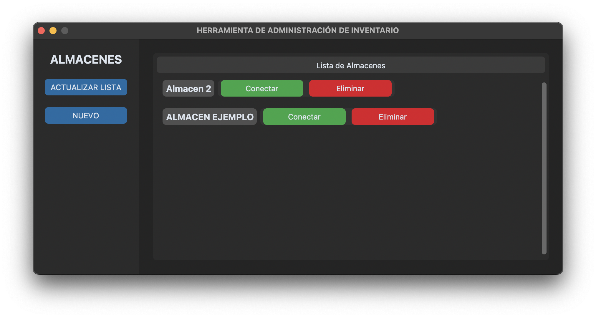
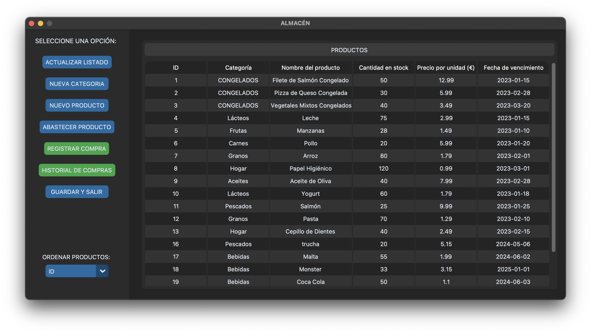
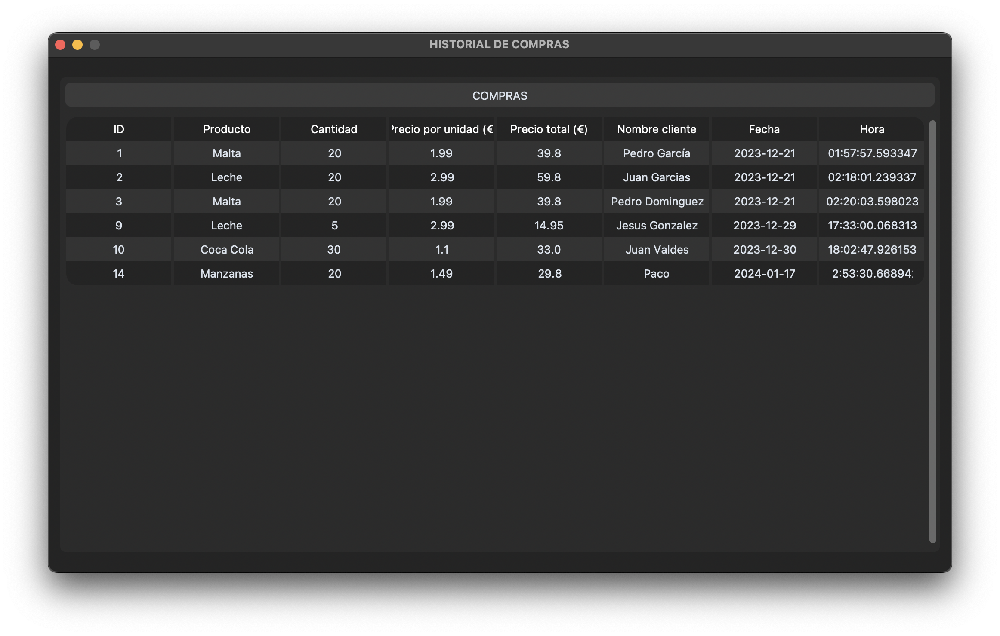
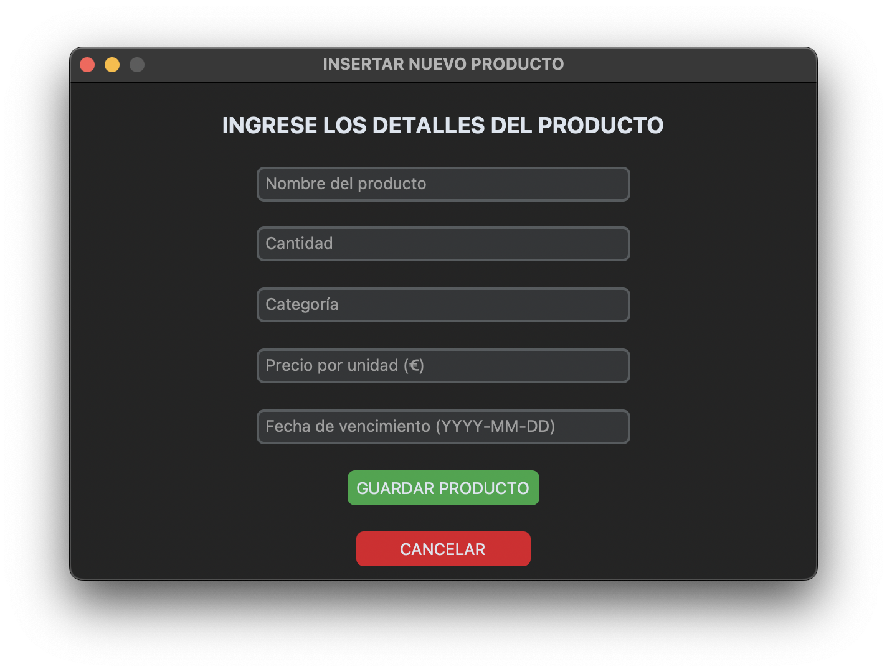

**Inventory Management Tool**

This Python application streamlines warehouse operations by providing a centralized platform for managing inventory. It connects to a PostgreSQL database to securely store detailed product information, including name, category, quantity, price, and expiration date.

**Key Features:**

* **Multi-warehouse management:** Manage multiple warehouses from a single interface.
* **Detailed product tracking:** Offers a comprehensive record of each product's status.
* **Transaction logging:** Keeps a history of purchases and sales.
* **Custom reports:** Generate reports to analyze inventory and make informed decisions.
* **Intuitive interface:** Designed for easy use.

This tool is an ideal starting point for small and medium-sized businesses looking to optimize their inventory management and reduce errors.

